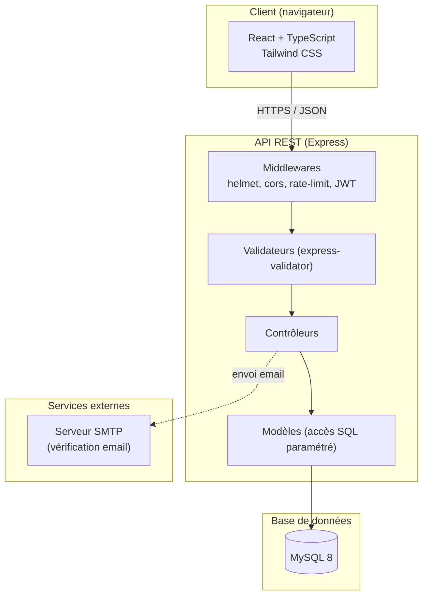
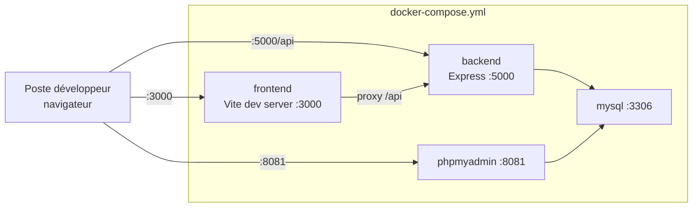
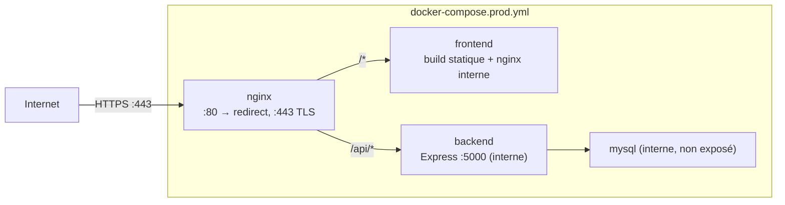

# Architecture technique — FitTrack

## 1. Vue d'ensemble (architecture en couches)

## 2. Architecture de déploiement — Développement

En développement, le frontend (serveur Vite) et le backend sont exposés
directement sur l'hôte pour faciliter le rechargement à chaud (hot reload).
phpMyAdmin permet d'inspecter la base sans client SQL dédié.

## 3. Architecture de déploiement — Production

Différences clés avec le développement :
- Seul le conteneur `nginx` publie un port sur l'hôte (80 et 443) ; MySQL et le
  backend ne sont accessibles que sur le réseau Docker interne.
- Le frontend est un build statique React servi par un Nginx interne, pas un
  serveur de développement.
- Tout le trafic HTTP est redirigé vers HTTPS (`nginx/nginx.prod.conf`).

Voir [`deploiement-production.md`](deploiement-production.md) pour la procédure
de mise en route détaillée.

## 4. Flux d'une requête authentifiée

1. Le client envoie une requête avec l'en-tête `Authorization: Bearer <JWT>`.
2. `helmet` ajoute les en-têtes de sécurité, `cors` valide l'origine.
3. `authMiddleware` vérifie la signature et l'expiration du JWT, injecte
   `req.user`.
4. Si la route est protégée par rôle, `checkRole('admin')` vérifie
   `req.user.role`.
5. Le validateur (`express-validator`) contrôle le format des données reçues.
6. Le contrôleur orchestre l'appel au modèle, qui exécute des requêtes SQL
   paramétrées (`pool.execute(sql, [valeurs])` — aucune concaténation de
   valeur utilisateur dans le SQL).
7. La réponse JSON est renvoyée au client.

## 5. Choix technologiques justifiés

| Choix | Justification |
|---|---|
| Express plutôt qu'un framework "full-stack" | API REST simple, contrôle explicite des middlewares de sécurité |
| MySQL plutôt que NoSQL | Données fortement relationnelles (utilisateurs, séances, exercices, programmes) avec contraintes d'intégrité (clés étrangères) |
| JWT stateless plutôt que sessions serveur | Pas de stockage de session côté serveur, scalabilité horizontale facilitée |
| React + Vite | Démarrage rapide, typage fort avec TypeScript, écosystème mature (recharts pour les graphiques) |
| Docker Compose | Reproductibilité de l'environnement, séparation claire dev/prod |
