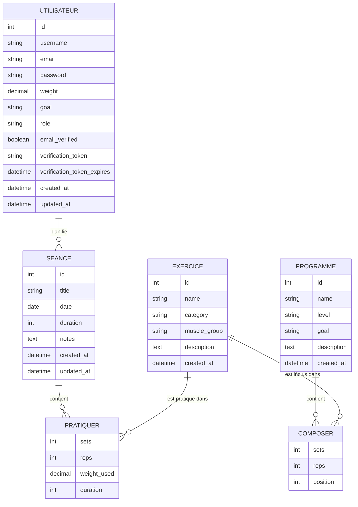

# Modélisation Merise — MCD / MLD

## Modèle Conceptuel de Données (MCD)



### Règles de gestion

1. Un utilisateur peut planifier zéro, une ou plusieurs séances ; une séance appartient à un seul utilisateur (suppression en cascade).
2. Une séance contient zéro, un ou plusieurs exercices pratiqués ; un exercice peut être pratiqué dans zéro, une ou plusieurs séances (association porteuse de données : séries, répétitions, charge, durée).
3. Un exercice ne peut être supprimé du catalogue s'il est référencé par au moins une séance existante (intégrité référentielle `ON DELETE RESTRICT`).
4. Le rôle (`role`) d'un utilisateur vaut `user` par défaut ; seul un compte `admin` peut gérer le catalogue d'exercices et les rôles des autres comptes.
5. Un compte est créé avec `email_verified = false` ; la connexion est refusée jusqu'à ce que l'utilisateur clique sur le lien de vérification reçu par email (token à usage unique, expirant après 24h).
6. Un programme pré-défini contient zéro, un ou plusieurs exercices (association porteuse de données : séries, répétitions, position) ; copier un programme crée une nouvelle séance personnelle pour l'utilisateur, indépendante du programme d'origine.

## Modèle Logique de Données (MLD)

```
UTILISATEUR (id, username, email, password, weight, goal, role, email_verified,
             verification_token, verification_token_expires, created_at, updated_at)
  PK : id
  Contraintes : username UNIQUE, email UNIQUE, role ENUM('user','admin')

EXERCICE (id, name, category, muscle_group, description, created_at)
  PK : id
  Contraintes : category ENUM('Musculation','Cardio','Flexibilité')

SEANCE (id, user_id, title, date, duration, notes, created_at, updated_at)
  PK : id
  FK : user_id → UTILISATEUR(id)  ON DELETE CASCADE

PRATIQUER (id, seance_id, exercice_id, sets, reps, weight_used, duration)
  PK : id
  FK : seance_id  → SEANCE(id)   ON DELETE CASCADE
  FK : exercice_id → EXERCICE(id) ON DELETE RESTRICT

PROGRAMME (id, name, level, goal, description, created_at)
  PK : id
  Contraintes : level ENUM('débutant','intermédiaire','avancé'), goal ENUM('lose','maintain','gain')

COMPOSER (id, programme_id, exercice_id, sets, reps, position)
  PK : id
  FK : programme_id → PROGRAMME(id) ON DELETE CASCADE
  FK : exercice_id   → EXERCICE(id)  ON DELETE RESTRICT
```

> Correspondance avec le schéma SQL implémenté : `UTILISATEUR` → table `User`, `SEANCE` → table `Workout`, `EXERCICE` → table `Exercise`, `PRATIQUER` → table `WorkoutExercise`, `PROGRAMME` → table `Program`, `COMPOSER` → table `ProgramExercise` (voir [`database/init.sql`](../database/init.sql)).
