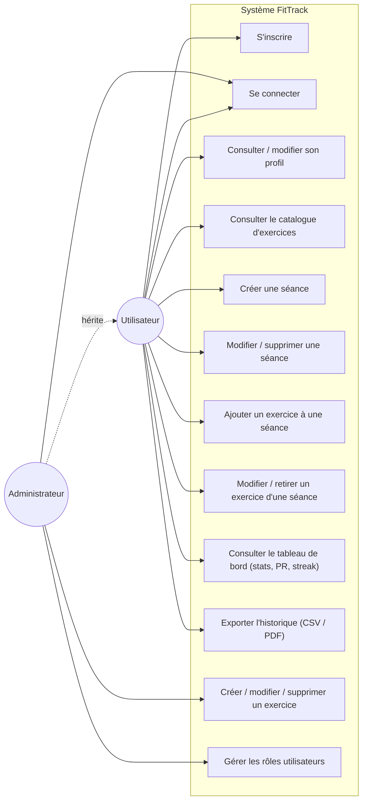

# Diagramme de cas d'utilisation — FitTrack

## Description des cas d'utilisation principaux

| Cas d'utilisation | Acteur | Pré-condition | Description |
|---|---|---|---|
| S'inscrire | Utilisateur | Email/username non utilisés | Création d'un compte avec mot de passe haché (Bcrypt) |
| Se connecter | Utilisateur, Admin | Compte existant | Authentification, émission d'un JWT (7 jours) |
| Créer une séance | Utilisateur | Authentifié | Création d'une séance datée, rattachée à l'utilisateur |
| Ajouter un exercice à une séance | Utilisateur | Séance existante et possédée par l'utilisateur | Association séance/exercice avec séries, répétitions, charge |
| Consulter le tableau de bord | Utilisateur | Authentifié | Agrégation des statistiques (durée totale, records, streak) |
| Créer / modifier / supprimer un exercice | Admin | Rôle `admin` | Gestion du catalogue d'exercices partagé entre tous les utilisateurs |
| Gérer les rôles utilisateurs | Admin | Rôle `admin` | Promotion/rétrogradation d'un compte utilisateur |
