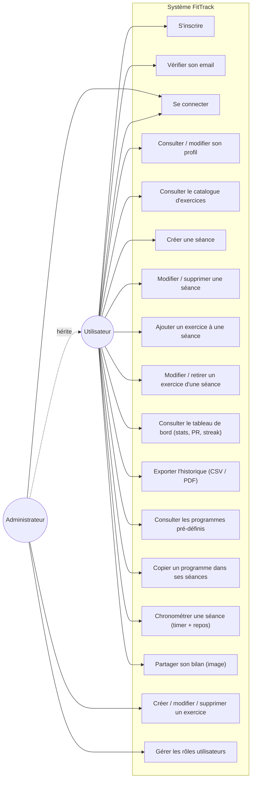

# Diagramme de cas d'utilisation — FitTrack

## Description des cas d'utilisation principaux

| Cas d'utilisation | Acteur | Pré-condition | Description |
|---|---|---|---|
| S'inscrire | Utilisateur | Email/username non utilisés, mot de passe conforme (maj/min/chiffre/spécial) | Création d'un compte non vérifié, mot de passe haché (Bcrypt), email de vérification envoyé |
| Vérifier son email | Utilisateur | Compte créé, token de vérification valide (24h) | Active le compte ; la connexion est refusée jusqu'à cette étape |
| Se connecter | Utilisateur, Admin | Compte existant et email vérifié | Authentification, émission d'un JWT (7 jours) |
| Créer une séance | Utilisateur | Authentifié | Création d'une séance datée, rattachée à l'utilisateur |
| Ajouter un exercice à une séance | Utilisateur | Séance existante et possédée par l'utilisateur | Association séance/exercice avec séries, répétitions, charge |
| Consulter le tableau de bord | Utilisateur | Authentifié | Agrégation des statistiques (durée totale, records, streak) |
| Copier un programme dans ses séances | Utilisateur | Authentifié, programme existant | Crée une nouvelle séance personnelle à partir d'un programme type, indépendante de l'original |
| Chronométrer une séance | Utilisateur | Sur la page de détail d'une séance | Chronomètre de durée totale + minuteur de repos avec notification sonore |
| Partager son bilan | Utilisateur | Authentifié | Génère une image récapitulative (Canvas) téléchargeable |
| Créer / modifier / supprimer un exercice | Admin | Rôle `admin` | Gestion du catalogue d'exercices partagé entre tous les utilisateurs |
| Gérer les rôles utilisateurs | Admin | Rôle `admin` | Promotion/rétrogradation d'un compte utilisateur |
