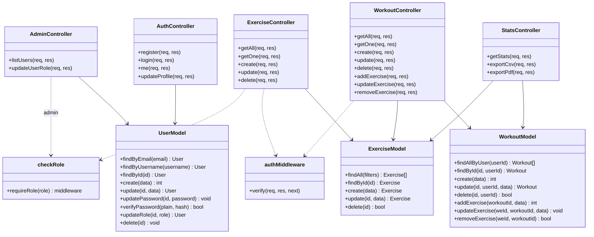

# Diagramme de classes — FitTrack (backend)

```mermaid
classDiagram
  class UserModel {
    +findByEmail(email) User
    +findByUsername(username) User
    +findById(id) User
    +create(data) int
    +update(id, data) User
    +updatePassword(id, password) void
    +verifyPassword(plain, hash) bool
    +updateRole(id, role) User
    +delete(id) void
  }

  class ExerciseModel {
    +findAll(filters) Exercise[]
    +findById(id) Exercise
    +create(data) Exercise
    +update(id, data) Exercise
    +delete(id) bool
  }

  class WorkoutModel {
    +findAllByUser(userId) Workout[]
    +findById(id, userId) Workout
    +create(data) int
    +update(id, userId, data) Workout
    +delete(id, userId) bool
    +addExercise(workoutId, data) int
    +updateExercise(weId, workoutId, data) void
    +removeExercise(weId, workoutId) bool
  }

  class AuthController {
    +register(req, res)
    +login(req, res)
    +me(req, res)
    +updateProfile(req, res)
  }

  class ExerciseController {
    +getAll(req, res)
    +getOne(req, res)
    +create(req, res)
    +update(req, res)
    +delete(req, res)
  }

  class WorkoutController {
    +getAll(req, res)
    +getOne(req, res)
    +create(req, res)
    +update(req, res)
    +delete(req, res)
    +addExercise(req, res)
    +updateExercise(req, res)
    +removeExercise(req, res)
  }

  class StatsController {
    +getStats(req, res)
    +exportCsv(req, res)
    +exportPdf(req, res)
  }

  class AdminController {
    +listUsers(req, res)
    +updateUserRole(req, res)
  }

  class authMiddleware {
    +verify(req, res, next)
  }

  class checkRole {
    +requireRole(role) middleware
  }

  AuthController --> UserModel
  AdminController --> UserModel
  ExerciseController --> ExerciseModel
  WorkoutController --> WorkoutModel
  WorkoutController --> ExerciseModel
  StatsController --> WorkoutModel
  StatsController --> ExerciseModel
  ExerciseController ..> authMiddleware
  ExerciseController ..> checkRole : create/update/delete
  AdminController ..> checkRole : admin
  WorkoutController ..> authMiddleware
```
