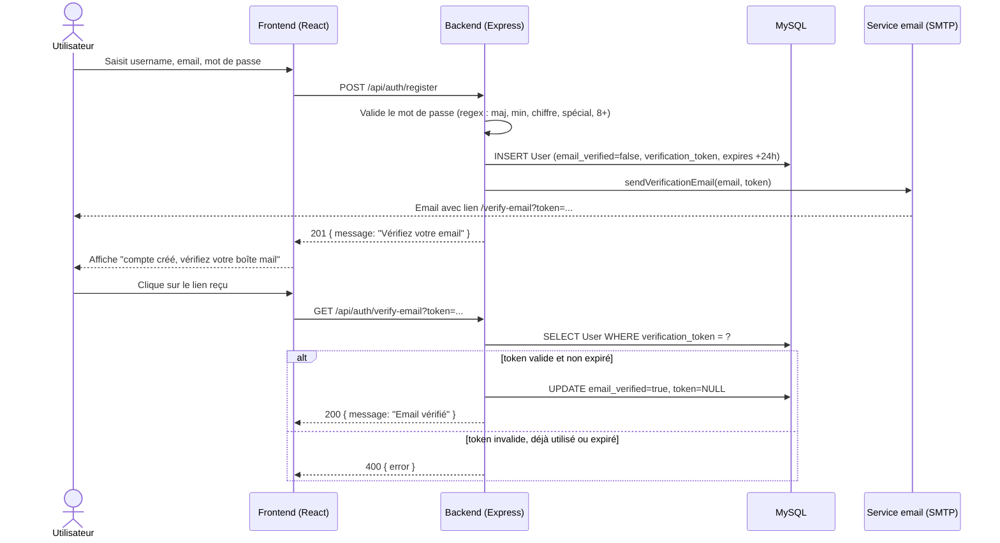
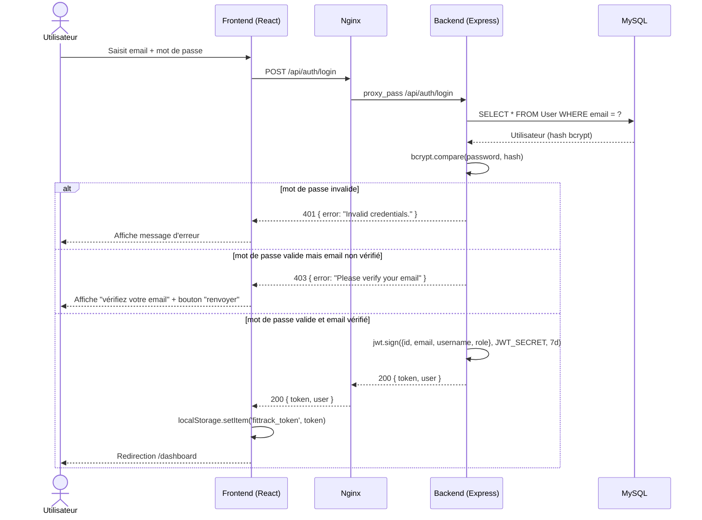
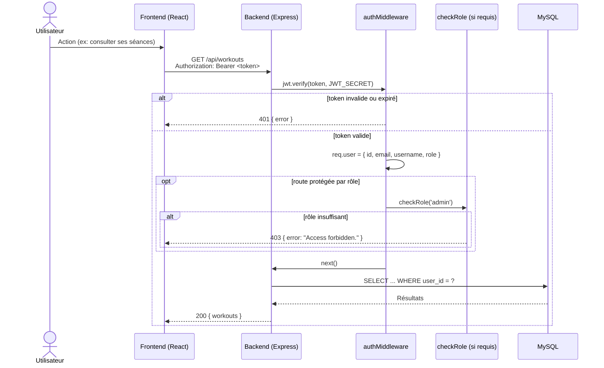

# Diagramme de séquence — Authentification & flux JWT

## Inscription & vérification d'email

```mermaid
sequenceDiagram
  actor U as Utilisateur
  participant F as Frontend (React)
  participant B as Backend (Express)
  participant DB as MySQL
  participant M as Service email (SMTP)

  U->>F: Saisit username, email, mot de passe
  F->>B: POST /api/auth/register
  B->>B: Valide le mot de passe (regex : maj, min, chiffre, spécial, 8+)
  B->>DB: INSERT User (email_verified=false, verification_token, expires +24h)
  B->>M: sendVerificationEmail(email, token)
  M-->>U: Email avec lien /verify-email?token=...
  B-->>F: 201 { message: "Vérifiez votre email" }
  F-->>U: Affiche "compte créé, vérifiez votre boîte mail"

  U->>F: Clique sur le lien reçu
  F->>B: GET /api/auth/verify-email?token=...
  B->>DB: SELECT User WHERE verification_token = ?
  alt token valide et non expiré
    B->>DB: UPDATE email_verified=true, token=NULL
    B-->>F: 200 { message: "Email vérifié" }
  else token invalide, déjà utilisé ou expiré
    B-->>F: 400 { error }
  end
```

## Connexion (login)

```mermaid
sequenceDiagram
  actor U as Utilisateur
  participant F as Frontend (React)
  participant N as Nginx
  participant B as Backend (Express)
  participant DB as MySQL

  U->>F: Saisit email + mot de passe
  F->>N: POST /api/auth/login
  N->>B: proxy_pass /api/auth/login
  B->>DB: SELECT * FROM User WHERE email = ?
  DB-->>B: Utilisateur (hash bcrypt)
  B->>B: bcrypt.compare(password, hash)
  alt mot de passe invalide
    B-->>F: 401 { error: "Invalid credentials." }
    F-->>U: Affiche message d'erreur
  else mot de passe valide mais email non vérifié
    B-->>F: 403 { error: "Please verify your email" }
    F-->>U: Affiche "vérifiez votre email" + bouton "renvoyer"
  else mot de passe valide et email vérifié
    B->>B: jwt.sign({id, email, username, role}, JWT_SECRET, 7d)
    B-->>N: 200 { token, user }
    N-->>F: 200 { token, user }
    F->>F: localStorage.setItem('fittrack_token', token)
    F-->>U: Redirection /dashboard
  end
```

## Requête authentifiée (vérification JWT)

```mermaid
sequenceDiagram
  actor U as Utilisateur
  participant F as Frontend (React)
  participant B as Backend (Express)
  participant MW as authMiddleware
  participant RW as checkRole (si requis)
  participant DB as MySQL

  U->>F: Action (ex: consulter ses séances)
  F->>B: GET /api/workouts<br/>Authorization: Bearer <token>
  B->>MW: jwt.verify(token, JWT_SECRET)
  alt token invalide ou expiré
    MW-->>F: 401 { error }
  else token valide
    MW->>MW: req.user = { id, email, username, role }
    opt route protégée par rôle
      MW->>RW: checkRole('admin')
      alt rôle insuffisant
        RW-->>F: 403 { error: "Access forbidden." }
      end
    end
    MW->>B: next()
    B->>DB: SELECT ... WHERE user_id = ?
    DB-->>B: Résultats
    B-->>F: 200 { workouts }
  end
```
